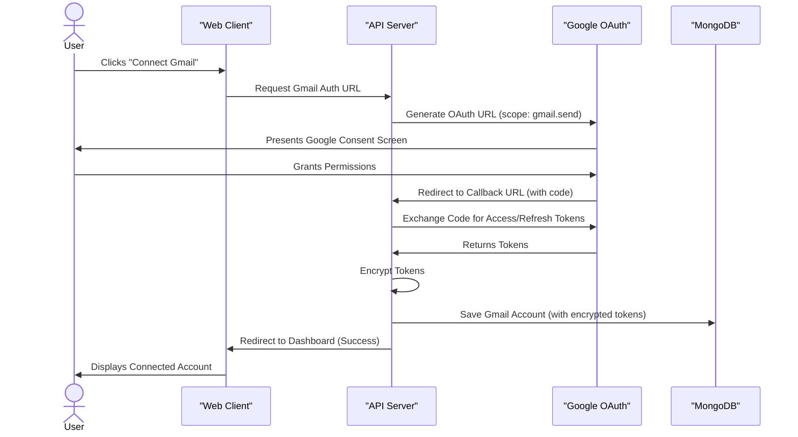
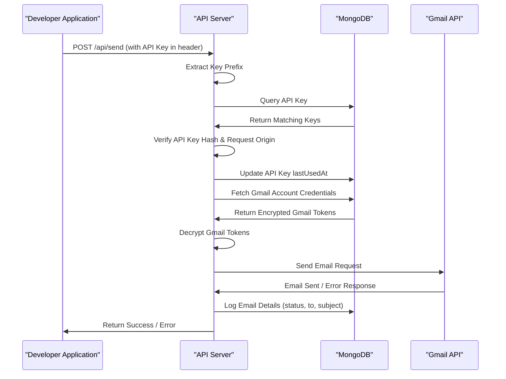
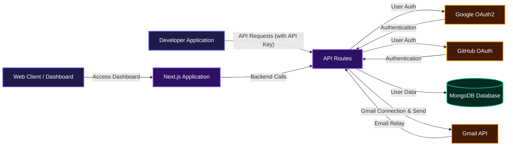

# SendLib: Transactional Email API for Your Customers 

The fastest way for founders and devs to send transactional emails to your customers (welcome messages, password resets, receipts) using their product's existing Gmail account. Zero domains to verify. Zero SMTP server stress. Just connect and send.

## Demo

<video src="https://res.cloudinary.com/dpswl8vzgkk/video/upload/q_auto/v1786180780/fadfas_fakwqx.mp4" controls width="100%"></video>

## Features

### Secure Gmail Integration

Easily connect your personal or Google Workspace Gmail accounts using secure OAuth 2.0. SendLib only requests the minimum necessary permissions to send emails on your behalf, and your credentials are never stored directly. This approach ensures high deliverability, as emails are sent from a trusted Google server.



### Effortless Email Sending via API

Send transactional emails with a single, straightforward REST API call. Whether you're sending welcome emails, password resets, or notifications, SendLib handles the delivery without needing any SMTP port configuration.



### Flexible API Key Management

Generate and manage multiple API keys for different applications or environments. Each key can be configured with allowed origins, adding an extra layer of security. Easily revoke compromised keys directly from your dashboard.

### Real-time Analytics and Logging

Keep an eye on your email sending activity with a dashboard that provides daily cap usage for each connected Gmail account and a detailed log of all sent and failed emails over the last 7 days.

## System Architecture / Design

SendLib leverages a Next.js application for both its frontend dashboard and backend API routes. User authentication is handled via GitHub or Google OAuth, and connected Gmail accounts are used to relay emails through the Gmail API. All user and application data is persisted in a MongoDB database.



## Installation

To get SendLib up and running on your local machine, follow these steps:

1.  **Clone the Repository**:
    ```bash
    git clone https://github.com/samueltuoyo15/send-liberty.git
    cd send-liberty
    ```

2.  **Install Dependencies**:
    ```bash
    npm install
    # or
    yarn install
    ```

3.  **Set Up Environment Variables**:
    Create a `.env.local` file in the root of the project based on the `.env.example` file. You'll need to fill in your MongoDB connection string and OAuth credentials.

    ```
    # MongoDB
    MONGODB_URI=mongodb+srv://<user>:<password>@cluster.mongodb.net/send-lib?retryWrites=true&w=majority

    # Auth
    JWT_SECRET=your_random_64_char_hex_string_here
    ENCRYPTION_KEY=a1b2c3d4e5f6a7b8c9d0e1f2a3b4c5d6e7f8a9b0c1d2e3f4a5b6c7d8e9f0a1b2

    # Google OAuth (for login AND Gmail connect same credentials)
    GOOGLE_CLIENT_ID=your_google_client_id
    GOOGLE_CLIENT_SECRET=your_google_client_secret
    GOOGLE_CALLBACK_URL=http://localhost:3000/api/gmail/callback # For local dev

    # GitHub OAuth
    GITHUB_CLIENT_ID=your_github_client_id
    GITHUB_CLIENT_SECRET=your_github_client_secret

    # Public env vars (exposed to browser)
    NEXT_PUBLIC_APP_URL=http://localhost:3000
    # NEXT_PUBLIC_PAYSTACK_PUBLIC_KEY=pk_live_... (if using Paystack)
    ```

    *   **MONGODB\_URI**: Your MongoDB connection string.
    *   **JWT\_SECRET**: A long, random string for JWT signing. You can generate one with `node -e "console.log(crypto.randomBytes(32).toString('hex'))"`.
    *   **ENCRYPTION\_KEY**: A 64-character hex string (32 bytes) for encrypting sensitive data like Gmail tokens. Generate with `node -e "console.log(crypto.randomBytes(32).toString('hex'))"`.
    *   **GOOGLE\_CLIENT\_ID** / **GOOGLE\_CLIENT\_SECRET**: Obtain these from the Google Cloud Console for OAuth. Make sure to add `http://localhost:3000/api/auth/google/callback` and `http://localhost:3000/api/gmail/callback` to your authorized redirect URIs.
    *   **GITHUB\_CLIENT\_ID** / **GITHUB\_CLIENT\_SECRET**: Obtain these from your GitHub OAuth Apps settings. Add `http://localhost:3000/api/auth/github/callback` to your authorized redirect URIs.
    *   **NEXT\_PUBLIC\_APP\_URL**: The public URL of your application. Use `http://localhost:3000` for local development.

4.  **Run the Development Server**:
    ```bash
    npm run dev
    # or
    yarn dev
    ```
    Open [http://localhost:3000](http://localhost:3000) in your browser to see the application.

## Usage

Once your SendLib instance is running and you've connected a Gmail account and generated an API key from the dashboard, you can start sending emails via the `/api/send` endpoint.

Here's how you can use the API in various languages:

### cURL

```bash
curl -X POST http://localhost:3000/api/send \
  -H "Authorization: Bearer YOUR_SECRET_API_KEY" \
  -H "Content-Type: application/json" \
  -d '{
    "from": "sender@gmail.com",
    "to": "user@example.com",
    "subject": "Hello via SendLib Webhook!",
    "html": "<p>This email was sent with <strong>SendLib</strong> — delivering straight to your customers!</p>",
    "text": "This email was sent with SendLib — delivering straight to your customers!",
    "replyTo": "support@yourdomain.com",
    "cc": "anotheruser@example.com",
    "bcc": ["audit@example.com"],
    "attachments": [
      {
        "filename": "document.pdf",
        "content": "JVBERi0xLjQKJcOkw7zD... (base64 encoded content)",
        "type": "application/pdf"
      }
    ]
  }'
```

### JavaScript (fetch API)

```javascript
const response = await fetch('http://localhost:3000/api/send', {
  method: 'POST',
  headers: {
    'Authorization': 'Bearer YOUR_SECRET_API_KEY',
    'Content-Type': 'application/json'
  },
  body: JSON.stringify({
    from: 'sender@gmail.com',
    to: 'user@example.com',
    subject: 'Hello via SendLib Webhook!',
    html: '<p>This email was sent with <strong>SendLib</strong>, delivering straight to your customers!</p>',
    text: 'This email was sent with SendLib, delivering straight to your customers!',
    replyTo: 'support@yourdomain.com',
    cc: 'anotheruser@example.com',
    bcc: ['audit@example.com'],
    attachments: [
      {
        filename: 'document.pdf',
        content: 'JVBERi0xLjQKJcOkw7zD... (base64 encoded content)',
        type: 'application/pdf'
      }
    ]
  })
});

const data = await response.json();
console.log(data);
```

### Python (requests)

```python
import requests
import json

url = "http://localhost:3000/api/send"
headers = {
  "Authorization": "Bearer YOUR_SECRET_API_KEY",
  "Content-Type": "application/json"
}
payload = {
  "from": "sender@gmail.com",
  "to": "user@example.com",
  "subject": "Hello via SendLib Webhook!",
  "html": "<p>This email was sent with <strong>SendLib</strong>, delivering straight to your customers!</p>",
  "text": "This email was sent with SendLib, delivering straight to your customers!",
  "replyTo": "support@yourdomain.com",
  "cc": "anotheruser@example.com",
  "bcc": ["audit@example.com"],
  "attachments": [
    {
      "filename": "document.pdf",
      "content": "JVBERi0xLjQKJcOkw7zD... (base64 encoded content)",
      "type": "application/pdf"
    }
  ]
}

response = requests.post(url, headers=headers, data=json.dumps(payload))
print(response.json())
```

### Go

```go
package main

import (
	"bytes"
	"encoding/json"
	"fmt"
	"net/http"
)

func main() {
	payload := map[string]interface{}{
		"from":    "sender@gmail.com",
		"to":      "user@example.com",
		"subject": "Hello via SendLib Webhook!",
		"html":    "<p>This email was sent with <strong>SendLib</strong>, delivering straight to your customers!</p>",
		"text":    "This email was sent with SendLib, delivering straight to your customers!",
		"replyTo": "support@yourdomain.com",
		"cc":      "anotheruser@example.com",
		"bcc":     []string{"audit@example.com"},
		"attachments": []map[string]string{
			{"filename": "document.pdf", "content": "JVBERi0xLjQKJcOkw7zD... (base64 encoded content)", "type": "application/pdf"},
		},
	}
	jsonPayload, _ := json.Marshal(payload)

	req, err := http.NewRequest("POST", "http://localhost:3000/api/send", bytes.NewBuffer(jsonPayload))
	if err != nil {
		fmt.Println("Error creating request:", err)
		return
	}
	req.Header.Set("Authorization", "Bearer YOUR_SECRET_API_KEY")
	req.Header.Set("Content-Type", "application/json")

	client := &http.Client{}
	resp, err := client.Do(req)
	if err != nil {
		fmt.Println("Error sending request:", err)
		return
	}
	defer resp.Body.Close()

	var result map[string]interface{}
	json.NewDecoder(resp.Body).Decode(&result)
	fmt.Println(result)
}
```

### Rust

```rust
use serde_json::json;
use reqwest::Client;

#[tokio::main]
async fn main() -> Result<(), Box<dyn std::error::Error>> {
    let client = Client::new();
    let payload = json!({
        "from": "sender@gmail.com",
        "to": "user@example.com",
        "subject": "Hello via SendLib Webhook!",
        "html": "<p>This email was sent with <strong>SendLib</strong>, delivering straight to your customers!</p>",
        "text": "This email was sent with SendLib, delivering straight to your customers!",
        "replyTo": "support@yourdomain.com",
        "cc": "anotheruser@example.com",
        "bcc": ["audit@example.com"],
        "attachments": [
            {
                "filename": "document.pdf",
                "content": "JVBERi0xLjQKJcOkw7zD... (base64 encoded content)",
                "type": "application/pdf"
            }
        ]
    });

    let res = client.post("http://localhost:3000/api/send")
        .header("Authorization", "Bearer YOUR_SECRET_API_KEY")
        .json(&payload)
        .send()
        .await?;

    let body = res.json::<serde_json::Value>().await?;
    println!("{:?}", body);

    Ok(())
}
```

### PHP

```php
<?php
$url = 'http://localhost:3000/api/send';
$apiKey = 'YOUR_SECRET_API_KEY';

$payload = [
    'from' => 'sender@gmail.com',
    'to' => 'user@example.com',
    'subject' => 'Hello via SendLib Webhook!',
    'html' => '<p>This email was sent with <strong>SendLib</strong>, delivering straight to your customers!</p>',
    'text' => 'This email was sent with SendLib, delivering straight to your customers!',
    'replyTo' => 'support@yourdomain.com',
    'cc' => 'anotheruser@example.com',
    'bcc' => ['audit@example.com'],
    'attachments' => [
        [
            'filename' => 'document.pdf',
            'content' => 'JVBERi0xLjQKJcOkw7zD... (base64 encoded content)',
            'type' => 'application/pdf'
        ]
    ]
];

$ch = curl_init($url);
curl_setopt($ch, CURLOPT_RETURNTRANSFER, true);
curl_setopt($ch, CURLOPT_POST, true);
curl_setopt($ch, CURLOPT_HTTPHEADER, [
    'Authorization: Bearer ' . $apiKey,
    'Content-Type: application/json'
]);
curl_setopt($ch, CURLOPT_POSTFIELDS, json_encode($payload));

$response = curl_exec($ch);
if (curl_errno($ch)) {
    echo 'cURL Error: ' . curl_error($ch);
} else {
    echo $response;
}
curl_close($ch);
```

### .NET (C# HttpClient)

```csharp
using System;
using System.Net.Http;
using System.Text;
using System.Threading.Tasks;
using Newtonsoft.Json; // Make sure to install Newtonsoft.Json

public class EmailSender
{
    private static readonly HttpClient client = new HttpClient();

    public static async Task Main(string[] args)
    {
        string apiUrl = "http://localhost:3000/api/send";
        string apiKey = "YOUR_SECRET_API_KEY";

        var payload = new
        {
            from = "sender@gmail.com",
            to = "user@example.com",
            subject = "Hello via SendLib Webhook!",
            html = "<p>This email was sent with <strong>SendLib</strong>, delivering straight to your customers!</p>",
            text = "This email was sent with SendLib, delivering straight to your customers!",
            replyTo = "support@yourdomain.com",
            cc = "anotheruser@example.com",
            bcc = new[] { "audit@example.com" },
            attachments = new[] {
                new {
                    filename = "document.pdf",
                    content = "JVBERi0xLjQKJcOkw7zD... (base64 encoded content)",
                    type = "application/pdf"
                }
            }
        };

        client.DefaultRequestHeaders.Add("Authorization", $"Bearer {apiKey}");
        string jsonPayload = JsonConvert.SerializeObject(payload);
        var content = new StringContent(jsonPayload, Encoding.UTF8, "application/json");

        HttpResponseMessage response = await client.PostAsync(apiUrl, content);
        response.EnsureSuccessStatusCode(); // Throws an exception if not successful
        string responseBody = await response.Content.ReadAsStringAsync();
        Console.WriteLine(responseBody);
    }
}
```

### Java (HttpClient)

```java
import java.net.URI;
import java.net.http.HttpClient;
import java.net.http.HttpRequest;
import java.net.http.HttpResponse;

public class EmailSender {

    public static void main(String[] args) throws Exception {
        HttpClient client = HttpClient.newHttpClient();
        String apiUrl = "http://localhost:3000/api/send";
        String apiKey = "YOUR_SECRET_API_KEY";

        String jsonPayload = """
            {
              "from": "sender@gmail.com",
              "to": "user@example.com",
              "subject": "Hello via SendLib Webhook!",
              "html": "<p>This email was sent with <strong>SendLib</strong>, delivering straight to your customers!</p>",
              "text": "This email was sent with SendLib, delivering straight to your customers!",
              "replyTo": "support@yourdomain.com",
              "cc": "anotheruser@example.com",
              "bcc": ["audit@example.com"],
              "attachments": [
                {
                  "filename": "document.pdf",
                  "content": "JVBERi0xLjQKJcOkw7zD... (base64 encoded content)",
                  "type": "application/pdf"
                }
              ]
            }
            """;

        HttpRequest request = HttpRequest.newBuilder()
                .uri(URI.create(apiUrl))
                .header("Authorization", "Bearer " + apiKey)
                .header("Content-Type", "application/json")
                .POST(HttpRequest.BodyPublishers.ofString(jsonPayload))
                .build();

        HttpResponse<String> response = client.send(request, HttpResponse.BodyHandlers.ofString());
        System.out.println(response.body());
    }
}
```

## Technologies Used

| Technology         | Description                                     |
| :----------------- | :---------------------------------------------- |
| **Next.js**        | React framework for production                  |
| **React**          | Frontend library for building user interfaces   |
| **TypeScript**     | Superset of JavaScript for type safety          |
| **Node.js**        | JavaScript runtime for server-side logic        |
| **MongoDB**        | NoSQL database for data persistence             |
| **Mongoose**       | ODM for MongoDB and Node.js                     |
| **`argon2`**       | Password hashing library                        |
| **`jsonwebtoken`** | JWT for secure authentication                   |
| **`googleapis`**   | Official Node.js client library for Google APIs |
| **`axios`**        | Promise-based HTTP client for the browser and Node.js |
| **`@tanstack/react-query`** | Powerful asynchronous state management for React |
| **Tailwind CSS**   | Utility-first CSS framework for rapid UI development |
| **Shadcn UI**      | Reusable UI components built with Tailwind CSS  |
| **`sonner`**       | Accessible toast notifications                  |
| **`canvas-confetti`** | For celebratory visual effects on milestones |

## Contributing

We welcome contributions! If you're interested in improving SendLib, please feel free to fork the repository, make your changes, and submit a pull request. We appreciate all efforts to make this project better.

## Author Info

*   **LinkedIn**: [Samuel Tuoyo](https://linkedin.com/in/samuel-tuoyo)
*   **X (Twitter)**: [@TuoyoS26091](https://x.com/TuoyoS26091)

---

[](https://www.typescriptlang.org/)
[](https://nextjs.org/)
[](https://react.dev/)
[](https://nodejs.org/en)
[](https://www.mongodb.com/)
[](https://tailwindcss.com/)

[](https://dokugen-readme.vercel.app)
