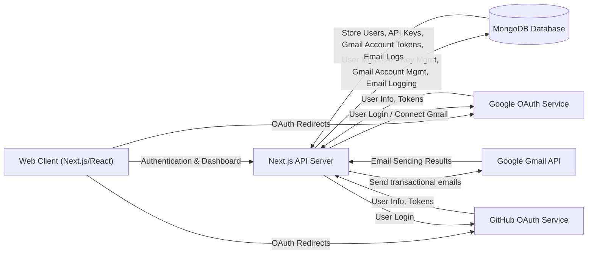

# SendLiberty - Email Relay API

If you've ever battled with blocked SMTP ports on cloud hosts like Railway or Render, or just wanted to send transactional emails without all the complex DNS setup, SendLiberty is for you. This project gives you a super simple REST API to send transactional and batch emails using your connected Gmail account, or even custom SMTP, all secured via OAuth2. It's built to get your emails delivered without the usual hosting headaches.

## Features

Here's what SendLiberty brings to the table:

*   **Bypass Blocked Ports**: Send transactional emails from *any* hosting environment, even those that strictly block traditional SMTP ports (25, 465, 587). SendLiberty routes your emails through your connected Google account using OAuth2, ensuring delivery without port restrictions.

*   **Zero DNS Setup**: Forget about configuring MX records, SPF, or DKIM. Connect your Google account, generate an API key, and you're ready to send transactional emails instantly.

*   **Simple REST API**: A single, straightforward POST endpoint handles all your email sending needs. Integrate it into any language or framework with minimal effort.

    ```mermaid
    sequenceDiagram
      actor YourApplication
      participant SendLibertyAPI as "SendLiberty API"
      participant AuthMiddleware as "Auth Middleware"
      participant DB as "MongoDB"
      participant GmailService as "Gmail Service"
      participant GoogleOAuth as "Google OAuth"
      participant GmailAPI as "Google Gmail API"

      YourApplication->>SendLibertyAPI: POST /api/send (with API Key)
      SendLibertyAPI->>AuthMiddleware: Verify API Key
      AuthMiddleware->>DB: Fetch ApiKey by prefix & hash
      DB-->>AuthMiddleware: ApiKey record
      AuthMiddleware-->>SendLibertyAPI: Authorized userId & ApiKey details
      SendLibertyAPI->>GmailService: Request to send email (to, subject, html, text, userId)
      GmailService->>DB: Fetch GmailAccount for userId
      DB-->>GmailService: Encrypted GmailAccount tokens
      GmailService->>GoogleOAuth: Decrypt tokens & refresh if expired
      GoogleOAuth-->>GmailService: Validated/Refreshed tokens
      GmailService->>GmailAPI: Send email via authenticated Gmail account
      GmailAPI-->>GmailService: Email sent (messageId)
      GmailService->>DB: Log email status
      DB-->>GmailService: Log success
      GmailService-->>SendLibertyAPI: Success
      SendLibertyAPI-->>YourApplication: Email Sent (messageId)
    ```

*   **OAuth2 Secured Connections**: We use industry-standard OAuth2 for connecting your Google accounts. This means we never see or store your Google password, only an encrypted access token that you can revoke directly from your Google security settings at any time.

    ```mermaid
    sequenceDiagram
      actor User
      participant Browser
      participant Next.jsApp as "SendLiberty Frontend"
      participant Next.jsAPI as "SendLiberty API"
      participant GoogleAuthService as "Google OAuth Provider"
      participant MongoDB

      User->>Browser: Clicks "Connect Gmail"
      Browser->>Next.jsApp: Navigates to /dashboard/accounts
      Next.jsApp->>Next.jsAPI: GET /api/gmail/connect (requires auth token)
      Next.jsAPI->>GoogleAuthService: Generate OAuth URL for User ID
      GoogleAuthService-->>Next.jsAPI: OAuth URL
      Next.jsAPI-->>Browser: Redirect to Google OAuth URL
      Browser->>GoogleAuthService: User authenticates & grants permissions
      GoogleAuthService-->>Browser: Redirect to /api/gmail/callback (with code & state=userId)
      Browser->>Next.jsAPI: GET /api/gmail/callback (code, userId)
      Next.jsAPI->>GoogleAuthService: Exchange code for tokens
      GoogleAuthService-->>Next.jsAPI: Access & Refresh Tokens
      Next.jsAPI->>Next.jsAPI: Encrypt tokens
      Next.jsAPI->>MongoDB: Save/Update GmailAccount (userId, email, encrypted tokens)
      MongoDB-->>Next.jsAPI: Account saved
      Next.jsAPI-->>Browser: Redirect to /dashboard/accounts?gmail_connected=true
      Browser->>Next.jsApp: Shows success message
    ```

*   **API Key Management**: Generate, revoke, and manage API keys directly from your dashboard. You can also restrict API keys to specific allowed origins for an extra layer of security.

    ```mermaid
    flowchart TD
        User["User (Dashboard)"] -- "Request New API Key (name, allowedOrigins)" --> Next.jsApp["Next.js Frontend"]
        Next.jsApp -- "POST /api/keys" --> Next.jsAPI["Next.js API Routes"]
        Next.jsAPI -- "Generate Random Key" --> CryptoLib["crypto.randomBytes"]
        Next.jsAPI -- "Hash Full Key" --> Argon2Lib["argon2.hash"]
        Next.jsAPI -- "Store KeyHash, Prefix, Origins" --> MongoDB["MongoDB Database"]
        MongoDB -- "Return apiKey._id" --> Next.jsAPI
        Next.jsAPI -- "Return Full Raw Key (once only!)" --> Next.jsApp
        Next.jsApp -- "Display Raw Key to User" --> User
        User -- "Copy Key" --> ExternalApp["Your Application"]
    ```

*   **Connected Gmail Account Management**: Easily connect multiple Gmail accounts and view their connection status. Disconnect accounts at any time, revoking access.

*   **Email Logs**: Keep track of all emails sent through SendLiberty with detailed logs, including recipient, subject, status (sent/failed), and timestamps.

## System Architecture / Design

SendLiberty operates as a robust email relay service, designed to be simple yet powerful. The frontend dashboard, built with Next.js and React, provides a user-friendly interface for managing accounts and API keys. All core logic and data persistence reside in the Next.js API routes, leveraging MongoDB for data storage and Google's OAuth2 and Gmail API for secure email sending.



## Installation

To get SendLiberty up and running locally, follow these steps:

1.  **Clone the Repository**:
    ```bash
    git clone https://github.com/samueltuoyo15/send-liberty.git
    cd send-liberty
    ```

2.  **Install Dependencies**:
    ```bash
    npm install
    # or
    yarn install
    # or
    pnpm install
    ```

3.  **Set Up Environment Variables**:
    Create a `.env.local` file in the root of the project and populate it with the necessary environment variables from `.env.example`.

    ```env
    # MongoDB Connection String
    MONGODB_URI=mongodb+srv://<user>:<password>@cluster.mongodb.net/send-liberty?retryWrites=true&w=majority

    # JWT Secret for session tokens (generate a strong random string)
    JWT_SECRET=your_random_64_char_hex_string_here

    # Encryption Key for Gmail tokens (must be a 64-char hex string - 32 bytes)
    ENCRYPTION_KEY=a1b2c3d4e5f6a7b8c9d0e1f2a3b4c5d6e7f8a9b0c1d2e3f4a5b6c7d8e9f0a1b2

    # Google OAuth credentials (for login AND Gmail connect)
    GOOGLE_CLIENT_ID=your_google_client_id
    GOOGLE_CLIENT_SECRET=your_google_client_secret
    # This URL is used for Gmail send OAuth callback (must be configured in Google Cloud Console)
    GOOGLE_CALLBACK_URL=https://yourdomain.vercel.app/api/gmail/callback

    # GitHub OAuth credentials
    GITHUB_CLIENT_ID=your_github_client_id
    GITHUB_CLIENT_SECRET=your_github_client_secret

    # Public URL for the application (e.g., your Vercel deployment URL)
    NEXT_PUBLIC_APP_URL=http://localhost:3000
    ```

    **Important**: Replace placeholder values with your actual credentials. For `JWT_SECRET` and `ENCRYPTION_KEY`, use strong, randomly generated hexadecimal strings.

4.  **Run the Development Server**:
    ```bash
    npm run dev
    # or
    yarn dev
    # or
    pnpm dev
    ```

    The application will now be running at `http://localhost:3000`.

## Usage

Once you've installed and started the project, you can:

1.  **Sign Up / Log In**:
    Navigate to `http://localhost:3000/login` to sign up or log in using your GitHub or Google account. This will authenticate you and redirect you to the dashboard.

2.  **Connect a Gmail Account**:
    From your dashboard, go to the "Gmail Accounts" section. Click "Connect New Account" to link a Gmail account. This will authorize SendLiberty to send transactional emails on your behalf via secure OAuth2.

3.  **Generate an API Key**:
    Head over to the "API Keys" section in your dashboard. Generate a new API key. **Make sure to copy the full API key when it's displayed, as it won't be shown again for security reasons.** You can also specify allowed origins to restrict where your API key can be used.

4.  **Send transactional emails via API**:
    Use the API key you generated to send transactional emails from your applications. Here are some examples:

    **cURL**
    ```bash
    curl -X POST https://api.sendliberty.com/api/send \
      -H "Authorization: Bearer YOUR_KEY" \
      -H "Content-Type: application/json" \
      -d '{
        "from": "sender@gmail.com",
        "to": "user@example.com",
        "subject": "Hello via Webhook!",
        "html": "<p>No SMTP needed.</p>",
        "replyTo": "support@yourdomain.com",
        "cc": "anotheruser@example.com",
        "bcc": ["audit@example.com"],
        "attachments": [
          { "filename": "invoice.pdf", "content": "base64_encoded_content_here" }
        ]
      }'
    ```

    **JavaScript (Fetch API)**
    ```javascript
    await fetch('https://api.sendliberty.com/api/send', {
      method: 'POST',
      headers: {
        'Authorization': 'Bearer YOUR_KEY',
        'Content-Type': 'application/json'
      },
      body: JSON.stringify({
        from: 'sender@gmail.com',
        to: 'user@example.com',
        subject: 'Hello via Webhook!',
        html: '<p>No SMTP needed.</p>',
        replyTo: 'support@yourdomain.com',
        cc: 'anotheruser@example.com',
        bcc: ['audit@example.com'],
        attachments: [
          { filename: 'invoice.pdf', content: 'base64_encoded_content_here' }
        ]
      })
    });
    ```

    **Python (Requests library)**
    ```python
    import requests

    url = "https://api.sendliberty.com/api/send"
    headers = {
      "Authorization": "Bearer YOUR_KEY",
      "Content-Type": "application/json"
    }
    payload = {
      "from": "sender@gmail.com",
      "to": "user@example.com",
      "subject": "Hello via Webhook!",
      "html": "<p>No SMTP needed.</p>",
      "replyTo": "support@yourdomain.com",
      "cc": "anotheruser@example.com",
      "bcc": ["audit@example.com"],
      "attachments": [
        { "filename": "invoice.pdf", "content": "base64_encoded_content_here" }
      ]
    }

    res = requests.post(url, json=payload, headers=headers)
    ```

    You can find more detailed API documentation on the `/docs` page (or your local `http://localhost:3000/docs`).

## Technologies Used

| Technology         | Description                                     |
| :----------------- | :---------------------------------------------- |
| **Next.js**        | React framework for full-stack applications     |
| **React**          | Frontend UI library                             |
| **TypeScript**     | Statically typed JavaScript                     |
| **MongoDB**        | NoSQL database for data storage                 |
| **Mongoose**       | MongoDB object modeling for Node.js             |
| **Google APIs**    | Integration with Google OAuth2 and Gmail API    |
| **Argon2**         | Password hashing library                        |
| **JWT**            | JSON Web Tokens for authentication              |
| **Tailwind CSS**   | Utility-first CSS framework                     |
| **TanStack Query** | Data fetching and caching library               |
| **Hugeicons**      | React icon library                              |
| **Sonner**         | Modern toast library                            |
| **Framer Motion**  | Animation library for React                     |

## Contributing

We welcome contributions to SendLiberty! If you're interested in improving the project, here's how you can help:

1.  **Fork the Repository**: Start by forking the `send-liberty` repository to your GitHub account.
2.  **Clone Your Fork**: Clone your forked repository to your local machine.
3.  **Create a New Branch**: Create a new branch for your feature or bug fix:
    ```bash
    git checkout -b feature/your-feature-name
    ```
4.  **Make Your Changes**: Implement your changes, following the existing code style and conventions.
5.  **Test Your Changes**: Ensure your changes don't introduce any regressions and work as expected.
6.  **Commit Your Changes**: Write a clear and concise commit message.
    ```bash
    git commit -m "feat: Add new awesome feature"
    ```
7.  **Push to Your Fork**: Push your branch to your forked repository:
    ```bash
    git push origin feature/your-feature-name
    ```
8.  **Open a Pull Request**: Submit a pull request from your fork to the `main` branch of the original `send-liberty` repository. Provide a detailed description of your changes.

## License

This project is licensed under the MIT License. See the repository for full details.

## Author Info

*   **LinkedIn**: [samueltuoyo](https://linkedin.com/in/samueltuoyo)
*   **X (Twitter)**: [TuoyoS26091](https://x.com/TuoyoS26091)

---

[](https://dokugen-readme.vercel.app)
